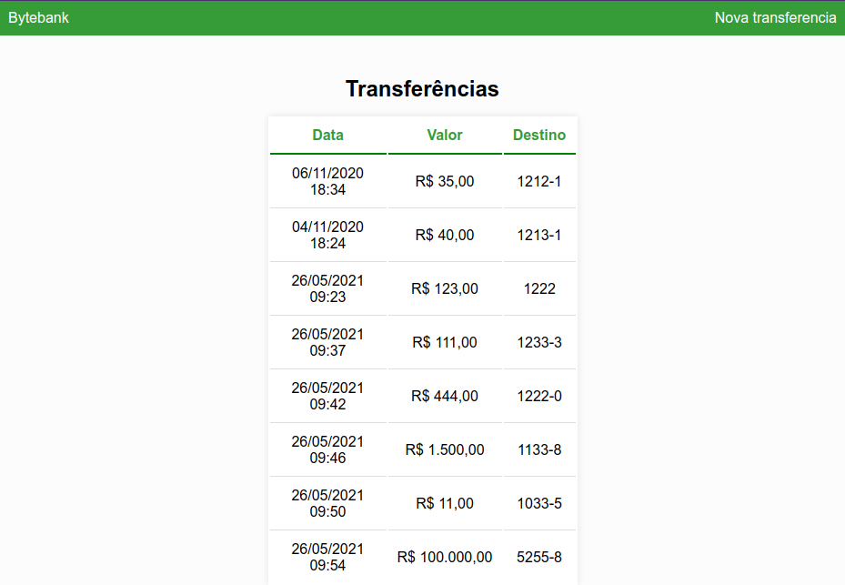
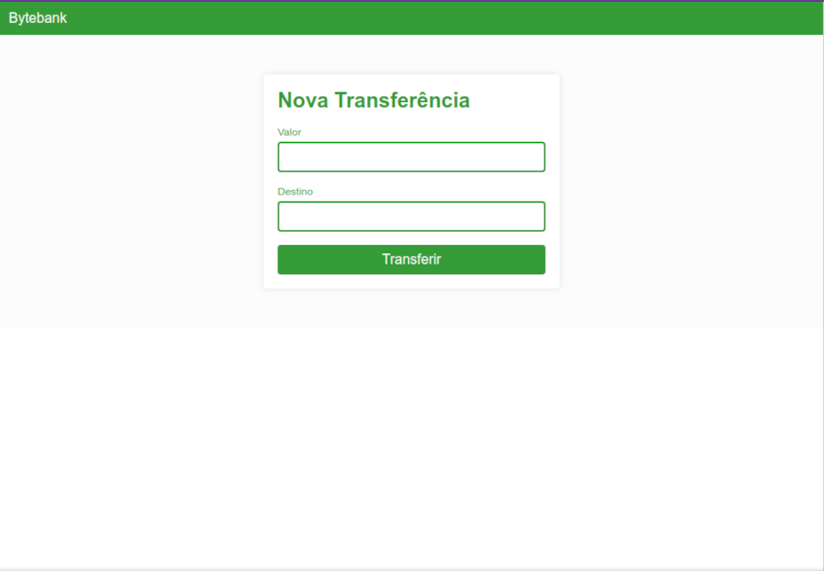

<h1 align="center">
    Bytebank
</h1>


## Sobre o projeto
Bytebank - É um sistema básico que simula transferências bancárias

Os usuários encontrarão as seguintes funcionalidades:
- Fazer transferência
- Visualizar transferências

Projeto desenvolvido para estudar e aprender Angular

## Layout

<p style="display: flex; align-items: flex-start; justify-content: center;">
   

  

</p>


## Tecnologias

As seguintes ferramentas foram usadas na construção do projeto:

- [Angular][angular]

## Como executar o projeto

### Pré-requisitos

Antes de começar, você vai precisar ter instalado em sua máquina as seguintes ferramentas:
[Git](https://git-scm.com), [Node.js][nodejs].
Além disto é bom ter um editor para trabalhar com o código como [VSCode][vscode]

### Rodando a aplicação web (Front End)

```bash
# Clone este repositório
$ git clone https://github.com/rafaelabc/bytebank

# Instale as dependências
$ npm install

# Inicie a aplicação
$ ng s -o

# A aplicação será aberta na porta:3000 - acesse http://localhost:3000
```
### Rodando json-server 

```bash
$ cd dados
# Instale as dependências
$ json-server --watch db.json

# Inicie a aplicação
$ ng s -o

# A aplicação será aberta na porta:3000 - acesse http://localhost:3000
```
Feito por Rafaela Custódio [Entre em contato!](https://www.linkedin.com/in/rafaela-custodio/)

[nodejs]: https://nodejs.org/
[angular]: https://angular.io/
[vscode]: https://code.visualstudio.com/
[vceditconfig]: https://marketplace.visualstudio.com/items?itemName=EditorConfig.EditorConfig
[license]: https://opensource.org/licenses/MIT
[vceslint]: https://marketplace.visualstudio.com/items?itemName=dbaeumer.vscode-eslint
